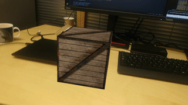

# Docs website

A static website hosting the documentation of the Spectacular AI SDK
see also https://github.com/SpectacularAI/sdk-examples.

## PDF guides

 * [Calibration manual](https://spectacularai.github.io/docs/pdf/calibration_manual.pdf)
 * [AprilTag instructions](https://spectacularai.github.io/docs/pdf/april_tag_instructions.pdf)
 * [OAK-D Fisheye calibration instructions](https://spectacularai.github.io/docs/pdf/oak_fisheye_calibration_instructions.pdf)
 * [OAK-D + u-blox GNSS-VIO instructions](https://spectacularai.github.io/docs/pdf/GNSS-VIO_OAK-D_Python.pdf)

## Updating

Run this script on a file that contains a new version of the Python plugin

    ./import-python-docs.sh python-plugin.zip

Then check

    git status

If there are changes, commit and push them.

# Spectacular AI demo GIFs

(also hosted on the same site)

See https://github.com/SpectacularAI/sdk-examples for the example
codes which were used to create these videos.

### Installing the SDK

### Spatial AI

### Retro AR

### HybVIO

